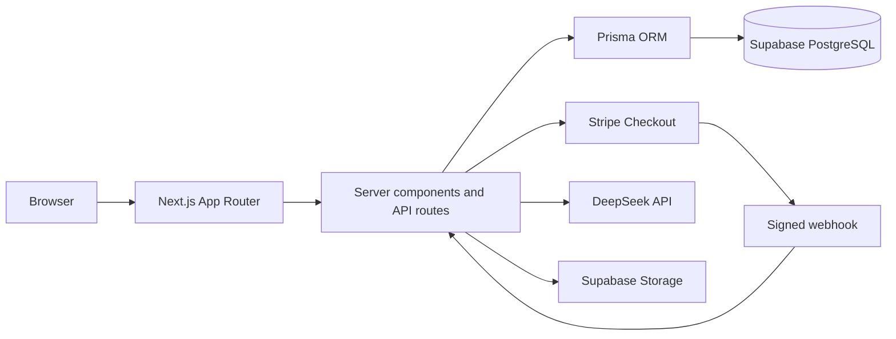

<div align="center">
  

# Zeus

**A production-ready electronics storefront built around reliable commerce flows, accessible UX, and thoughtful product discovery.**

[Live storefront](https://zeus-mell12.vercel.app) · [Deployment checklist](docs/deployment-checklist.md)


</div>

> The public deployment uses Stripe's test environment. No real payment is required to explore the checkout flow.

## ✨ Why Zeus stands out

Zeus began as a full-stack learning project and grew into a complete commerce application. The interface is deliberately minimal, responsive, and accessible, while the server handles the less-visible problems that make e-commerce systems interesting: inventory races, trusted pricing, duplicate checkout attempts, payment reconciliation, authorization, storage cleanup, and third-party service failures.

The application is written entirely in TypeScript and uses the Next.js App Router for both server-rendered pages and API routes.

## 🛍️ Feature highlights

### 🔎 Storefront and product discovery

- Responsive electronics catalog with category navigation, search, sorting, deal filtering, rating filtering, and discounted-price ranges.
- Curated home-page collections for featured products, deals, best sellers, and top-rated products.
- Detailed product pages with responsive imagery, point-and-click zoom, inventory messaging, related products, and dynamic SEO metadata.
- Database-backed carts and wishlists that stay synchronized across navigation and sessions.
- Clear handling for archived products already present in a customer's cart, wishlist, or order history.

### 🤖 Reviews and AI summaries

- One review per customer and product, enforced by a database constraint.
- Authenticated review creation, editing, and deletion with server-side ownership checks.
- Rating breakdowns, recent-review previews, and dedicated pages for complete review histories.
- Balanced DeepSeek summaries generated from customer feedback rather than product marketing copy.
- Content-addressed summary caching: the AI is called again only when the review set or selected model changes.
- Prompt-injection defenses that treat customer reviews as structured, untrusted content, plus request timeouts, safe error states, and database-backed rate limiting.

### 💳 Checkout and payments

- US shipping-address validation with accessible field-level feedback and focus management.
- Server-calculated discounts, 8% estimated tax, and free shipping on orders of $50 or more.
- Serializable database transactions that validate stock, reserve inventory, create the order, and clear the cart atomically.
- Idempotency keys that prevent duplicate orders when a checkout request is retried.
- Stripe Checkout with signed webhook verification, amount and customer matching, delayed-payment handling, and retry-safe payment processing.
- Order recovery flows for cancelled or interrupted payments, including payment-status reconciliation after returning from Stripe.

### 🛠️ Administration

- Role-protected dashboard with catalog, low-stock, order, fulfillment, and paid-revenue summaries.
- Product creation and editing with validation, image previews, merchandising flags, discounts, and inventory controls.
- JPEG, PNG, and WebP uploads to Supabase Storage with file-signature validation and managed cleanup of unused images.
- Product archiving for items that must remain linked to historical orders but should no longer appear in the storefront.
- Safe deletion for products without order history, including dependent review and managed-image cleanup.
- Paid-order fulfillment controls with guarded state transitions and concurrent-update protection.

### ♿ UX, accessibility, and resilience

- Mobile-first layouts tested from 320px through wide desktop viewports.
- Keyboard-friendly navigation, visible focus states, semantic landmarks, accessible status messages, and reduced-motion support.
- Route-level loading, empty, error, success, disabled, and not-found experiences.
- Subtle motion for navigation, filters, wishlist feedback, review actions, and administrative confirmations.
- Database failure responses designed to be safe, actionable, and retryable without leaking implementation details.

## 🏗️ Architecture



Important trust boundaries are kept on the server:

- Product prices, discounts, shipping, tax, and order totals are recalculated from database records.
- User identity comes from a signed, HTTP-only session cookie—not request bodies.
- Product and order administration requires an authenticated `ADMIN` role.
- Stripe is treated as the payment source of truth; returning to the success URL alone does not mark an order paid.
- State-changing application routes reject cross-origin requests.

## 🧰 Technology

| Area                 | Implementation                                                         |
| -------------------- | ---------------------------------------------------------------------- |
| Application          | Next.js 16 App Router, React 19, TypeScript 6                          |
| Styling              | Tailwind CSS 4, responsive design tokens, `next/font`                  |
| Data                 | PostgreSQL, Prisma ORM, Supabase                                       |
| Authentication       | Argon2 password hashing, signed JWT sessions, secure HTTP-only cookies |
| Payments             | Stripe Checkout and signed webhooks                                    |
| AI                   | DeepSeek chat completions with database caching                        |
| File storage         | Supabase Storage                                                       |
| Unit/component tests | Vitest, React Testing Library, jsdom                                   |
| Accessibility tests  | jest-axe                                                               |
| End-to-end tests     | Playwright with Chrome                                                 |
| Delivery             | GitHub Actions and Vercel                                              |

## 🚀 Local development

### 📋 Prerequisites

- Node.js 24 or a compatible current Node.js release.
- A PostgreSQL database, such as a Supabase project.
- Stripe test-mode credentials.
- A Supabase Storage bucket named `product-images` configured for public reads.
- A DeepSeek API key for AI review summaries.

### 1️⃣ Install the project

```bash
git clone https://github.com/mell62/ecommerce-app.git
cd ecommerce-app
npm install
```

### 2️⃣ Create the environment file

macOS or Linux:

```bash
cp .env.example .env
```

PowerShell:

```powershell
Copy-Item .env.example .env
```

Replace every placeholder in `.env`. Never commit that file or expose server-only secrets to browser code.

| Variable                   | Purpose                                                     |
| -------------------------- | ----------------------------------------------------------- |
| `DATABASE_URL`             | PostgreSQL connection used by Prisma.                       |
| `SESSION_SECRET`           | Session-signing secret with at least 32 characters.         |
| `RATE_LIMIT_SECRET`        | A different secret used to obscure rate-limit bucket keys.  |
| `NEXT_PUBLIC_BASE_URL`     | Application origin, such as `http://localhost:3000`.        |
| `NEXT_PUBLIC_SUPABASE_URL` | Public HTTPS URL for the Supabase project.                  |
| `SUPABASE_SECRET_KEY`      | Server-only Supabase key used for product image management. |
| `STRIPE_SECRET_KEY`        | Stripe test secret key.                                     |
| `STRIPE_WEBHOOK_SECRET`    | Signing secret for the matching Stripe webhook endpoint.    |
| `DEEPSEEK_API_KEY`         | Server-only API key used for review summaries.              |
| `DEEPSEEK_MODEL`           | Optional DeepSeek model override.                           |

Validate the configuration before starting the app:

```bash
npm run validate:env
```

### 3️⃣ Prepare the database

```bash
npx prisma generate
npx prisma migrate dev
npm run seed
```

> **Warning:** `npm run seed` is intentionally destructive fixture setup. It deletes existing products, orders, cart items, wishlist items, reviews, and cached summaries before loading the demo catalog. Run it only against a disposable development database—never Production.

### 4️⃣ Start the application

```bash
npm run dev
```

Open [http://localhost:3000](http://localhost:3000).

For local webhook testing, forward Stripe events to `/api/stripe/webhook` and place the forwarding command's `whsec_...` value in `STRIPE_WEBHOOK_SECRET`.

## ✅ Quality checks

```bash
npm run lint                 # ESLint
npm run typecheck            # TypeScript without emitting files
npm test                     # Unit, API, component, and accessibility tests
npm run test:payments        # Payment-focused test subset
npm run build                # Prisma generation and production build
npm run test:e2e             # Playwright customer journeys
```

The end-to-end suite covers registration and login, catalog discovery, mobile navigation, wishlist and cart behavior, checkout and orders, and complete review CRUD. GitHub Actions runs dependency installation, Prisma generation, linting, type-checking, and the Vitest suite for pushes to `main` and pull requests.

## 🗂️ Project structure

```text
ecommerce-app/
├── src/app/                 # Pages, route boundaries, metadata, and API routes
├── src/components/          # Reusable storefront and administration UI
├── src/lib/                 # Domain logic, validation, security, and integrations
├── prisma/                  # Schema, migrations, catalog fixtures, and seed scripts
├── e2e/                     # Playwright customer-journey tests
├── docs/                    # Operational documentation
├── public/                  # Brand and catalog assets
└── .github/workflows/       # Continuous integration
```

## ☁️ Deployment

Zeus is deployed on Vercel with Supabase PostgreSQL and Storage. Production releases require environment-scoped secrets, committed Prisma migrations, a stable HTTPS origin, and a Stripe webhook created specifically for that origin.

Follow the [deployment checklist](docs/deployment-checklist.md) for the complete release, migration, webhook, smoke-test, and rollback procedure.

## 🧠 Engineering decisions worth exploring

- [`src/lib/order-service.ts`](src/lib/order-service.ts) — idempotent, concurrency-safe order creation and inventory reservation.
- [`src/lib/payment-service.ts`](src/lib/payment-service.ts) — verified, retry-safe payment state transitions.
- [`src/lib/review-summary-cache.ts`](src/lib/review-summary-cache.ts) — deterministic AI cache invalidation based on review content.
- [`src/lib/session.ts`](src/lib/session.ts) — short, auditable signed-session implementation.
- [`src/lib/rate-limit.ts`](src/lib/rate-limit.ts) — shared database-backed throttling for serverless runtimes.
- [`src/app/api/admin/product-images/route.ts`](src/app/api/admin/product-images/route.ts) — authenticated image validation, upload, and cleanup.
